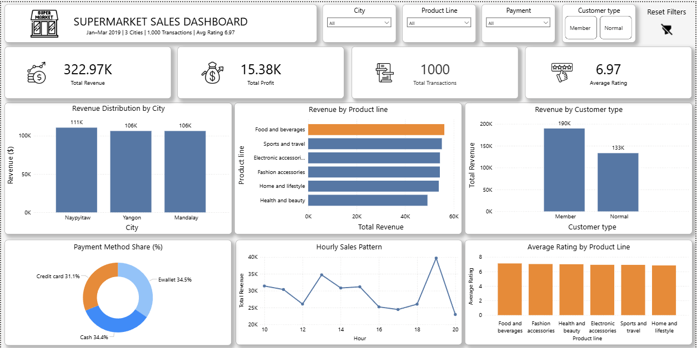
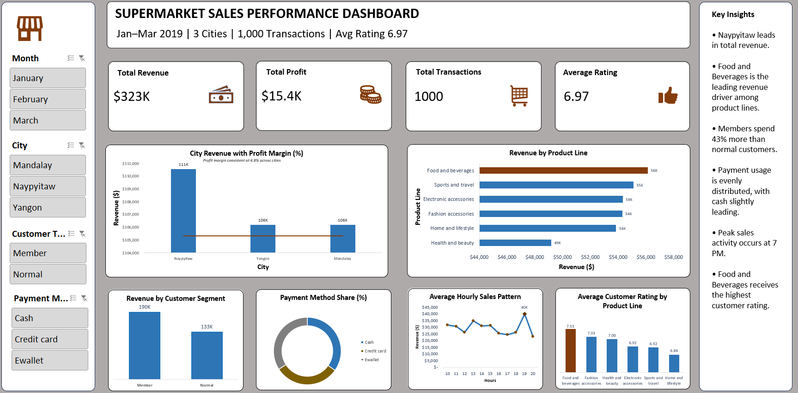

# 🛒 Supermarket Sales Data Analysis

**Excel • Python • SQL • Power BI**

## 📊 Project Overview

This project presents an **end-to-end data analysis workflow** using the Supermarket Sales dataset. The analysis explores transaction data to uncover **sales performance, customer behavior, and product trends** across multiple supermarket branches.

The goal of this project is to demonstrate how common **data analytics tools** can be used to extract insights and support **data-driven decision making**.

Currently, the project includes analysis using **Excel and Python**, while **SQL queries and Power BI dashboards are still in progress**.

---

# 📁 Dataset

This project uses the **Supermarket Sales Dataset** available on Kaggle.

**Dataset Source:**  
https://www.kaggle.com/datasets/faresashraf1001/supermarket-sales

**Uploaded by:** Fares Ashraf

The dataset contains **1,000 supermarket transactions** from three cities with detailed information on products, customers, payment methods, and transaction times.

### Dataset Features

- Invoice ID
- Branch
- City
- Customer Type
- Gender
- Product Line
- Unit Price
- Quantity
- Tax
- Total Revenue
- Payment Method
- Date & Time
- Customer Rating

---

# 🎯 Project Goals

The objective of this project is to analyze supermarket transactions and answer key business questions such as:

- Which **city generates the highest revenue**?
- Which **product categories drive the most sales**?
- How does **customer membership affect spending behavior**?
- What are the **most common payment methods**?
- What time of day generates the **highest sales activity**?
- How consistent is the **profit margin across transactions**?

---

# 🛠 Tools & Technologies

This project demonstrates practical use of common **data analyst tools**.

## Excel

Used for initial **data cleaning and dashboard creation**.

Tasks performed:

- Data cleaning and preparation
- Pivot table analysis
- KPI calculations
- Dashboard creation with slicers and charts

---

## Python

Python was used for **Exploratory Data Analysis (EDA)** and visualization.

Libraries used:

- pandas
- matplotlib

Analysis performed:

- Revenue distribution by city
- Product line performance
- Customer spending behavior
- Hourly sales trends
- Customer rating distribution

Python Notebook:

```
Python/Supermarket Sales Analysis.ipynb
```

---

## SQL (PostgreSQL)

🚧 **Currently in progress**

Planned SQL analysis includes:

- Revenue by city
- Revenue by product line
- Customer spending comparison
- Payment method distribution
- Hourly sales trends

SQL File:

```
sql/supermarket_analysis.sql
```

---

## Power BI

🚧 **Currently in progress**
### Dashboard Preview


Dashboard File:

```
powerbi/supermarket_dashboard.pbix
```

---

# 📊 Excel Dashboard

Excel was used to create a **sales performance dashboard** using pivot tables, charts, and slicers.

### Key Metrics

- Total Revenue
- Total Profit
- Total Transactions
- Average Customer Rating

### Dashboard Preview




---

# 🐍 Python Analysis

Python was used to perform **Exploratory Data Analysis (EDA)** to identify patterns and trends within the dataset.

The analysis includes:

- Revenue distribution by city
- Product line performance
- Customer spending behavior
- Hourly sales trends
- Customer rating distribution

---

# 📈 Key Business Insights

Initial analysis reveals several interesting insights:

- **Naypyitaw generates the highest overall revenue**
- **Food and Beverages is the top-performing product line**
- **Members tend to spend more than normal customers**
- Sales activity peaks during **evening hours**
- Payment methods are relatively **evenly distributed**
- Profit margin remains **consistent across transactions**

---

# 💡 Skills Demonstrated

This project highlights several important **data analytics skills**:

- Data cleaning and preparation
- Exploratory data analysis
- Data visualization
- Dashboard development
- Business insight generation
- Cross-tool analytics workflow

---

# 👤 Author

**Arvin Kelly Butiong**  
Aspiring Data Analyst
